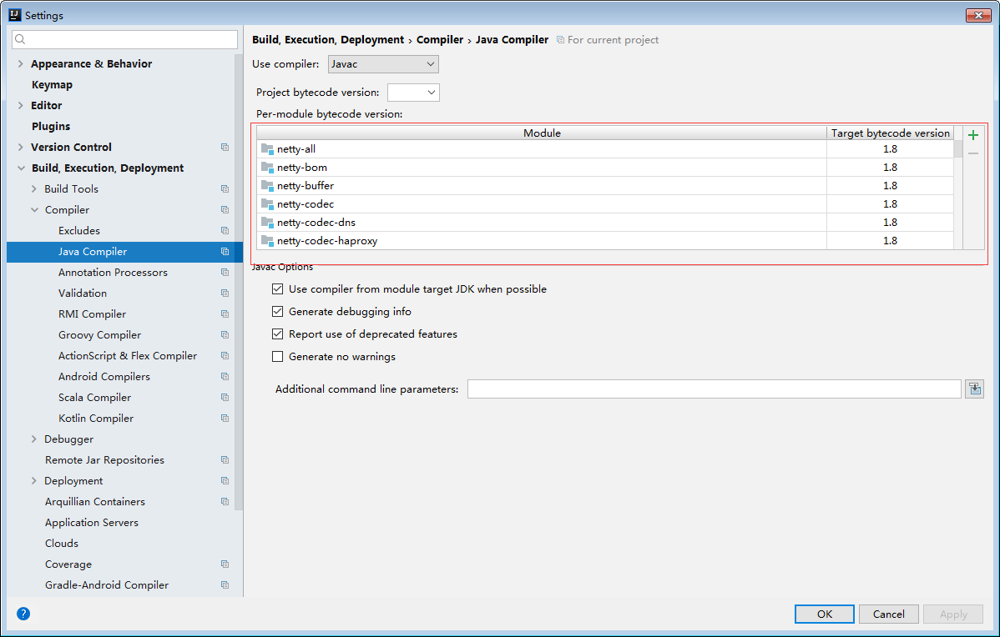

#### 一、导入源码
1，github下载源码:https://github.com/netty/netty

2，执行maven指令如下：

    mvn install -DskipTests  -Dcheckstyle.skip=true

3,编译之后，idea导入开发工具。

可以执行如下指令： mvn idea:idea -DskipTests  -Dcheckstyle.skip=true
    或者 mvn eclipse:eclipse -DskipTests  -Dcheckstyle.skip=true

Error:java: Compilation failed: internal java compiler error

解决办法很简单：第一种办法: File-->Setting...-->Build,Execution,Deployment-->Compiler-->Java Compiler 设置相应Module的target bytecode version的合适版本（跟你jdk版本一致），这里我改成1.8版本的。

第二种办法:最外层的pom.xml 把这个换成自己的jdk版本(测试了这种方法,会运行不了java文件)
  <maven.compiler.source>1.6</maven.compiler.source>
  <maven.compiler.target>1.6</maven.compiler.target>
  
 
#### 二、问题总结
- 1、NioEventLoop总结
  - 默认情况下netty服务端启动多少个线程?何时启动?
  > 默认cpu核心数 * 2倍线程数;判断是否在本线程,如果是表示已启动,如果不是调用doStartThread方法启动。
  - netty如何解决空轮询bug?
  > 判断select所花费的时间,如果是很快执行完,这样的现象如果达到512次(默认的次数),则重建一个select,把旧的select有效属性赋值到新的select,最后替换select。
  - netty如何保证异步串行无锁化?
  > 通过inEventLoop()判断如果是外部线程,则把操作封装成task放到MpscQueue里,后面会被挨个执行。
  
  
  
  
  
  
  
  
  
  
# Netty Project

Netty is an asynchronous event-driven network application framework for rapid development of maintainable high performance protocol servers & clients.

## Links

* [Web Site](http://netty.io/)
* [Downloads](http://netty.io/downloads.html)
* [Documentation](http://netty.io/wiki/)
* [@netty_project](https://twitter.com/netty_project)

## How to build

For the detailed information about building and developing Netty, please visit [the developer guide](http://netty.io/wiki/developer-guide.html).  This page only gives very basic information.

You require the following to build Netty:

* Latest stable [Oracle JDK 7](http://www.oracle.com/technetwork/java/)
* Latest stable [Apache Maven](http://maven.apache.org/)
* If you are on Linux, you need [additional development packages](http://netty.io/wiki/native-transports.html) installed on your system, because you'll build the native transport.

Note that this is build-time requirement.  JDK 5 (for 3.x) or 6 (for 4.0+) is enough to run your Netty-based application.

## Branches to look

Development of all versions takes place in each branch whose name is identical to `<majorVersion>.<minorVersion>`.  For example, the development of 3.9 and 4.0 resides in [the branch '3.9'](https://github.com/netty/netty/tree/3.9) and [the branch '4.0'](https://github.com/netty/netty/tree/4.0) respectively.

## Usage with JDK 9

Netty can be used in modular JDK9 applications as a collection of automatic modules. The module names follow the
reverse-DNS style, and are derived from subproject names rather than root packages due to historical reasons. They
are listed below:

 * `io.netty.all`
 * `io.netty.buffer`
 * `io.netty.codec`
 * `io.netty.codec.dns`
 * `io.netty.codec.haproxy`
 * `io.netty.codec.http`
 * `io.netty.codec.http2`
 * `io.netty.codec.memcache`
 * `io.netty.codec.mqtt`
 * `io.netty.codec.redis`
 * `io.netty.codec.smtp`
 * `io.netty.codec.socks`
 * `io.netty.codec.stomp`
 * `io.netty.codec.xml`
 * `io.netty.common`
 * `io.netty.handler`
 * `io.netty.handler.proxy`
 * `io.netty.resolver`
 * `io.netty.resolver.dns`
 * `io.netty.transport`
 * `io.netty.transport.epoll` (`native` omitted - reserved keyword in Java)
 * `io.netty.transport.kqueue` (`native` omitted - reserved keyword in Java)
 * `io.netty.transport.unix.common` (`native` omitted - reserved keyword in Java)
 * `io.netty.transport.rxtx`
 * `io.netty.transport.sctp`
 * `io.netty.transport.udt`

Automatic modules do not provide any means to declare dependencies, so you need to list each used module separately
in your `module-info` file.
