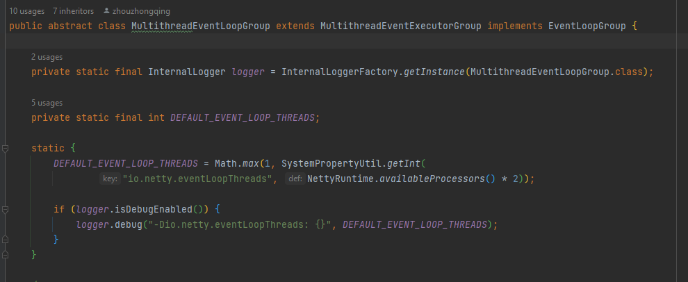

- Netty中默认的线程数：

- 在《Java并发编程实战》一书中给出公式：
>	Nthreads = Ncpu x Ucpu x (1 + W/C)

>	Ncpu = CPU的数量

>	Ucpu = 目标CPU的使用率， 0 <= Ucpu <= 1

>	W/C = 等待时间与计算时间的比率

> 例如：平均每个线程计算运行时间为0.5s，而线程等待时间（非计算时间，比如IO）为0.8s，目标CPU的使用率是80%，CPU核心数为12，那么根据上面这个公式估算得到：12 * 0.8 (1 + 0.8/0.5)  约等于 24。